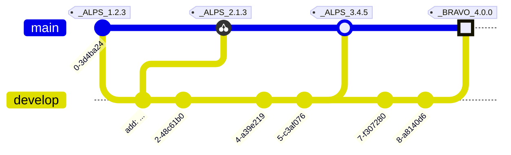

# RELEASE NOTES

All notable changes to this project will be documented in this file.

The format is based on [Keep a Changelog](https://keepachangelog.com/en/1.0.0/),
and this project adheres to a flavor of [Semantic Versioning](https://semver.org/spec/v2.0.0.html)
which includes [Scopes and Epochs](#epoch-scoped-semver).

---


#### Quick Navigation

**Scope** | Current Release | Commit Count
:--- | :---: | :---:
[**Electron**](#electron) | Unreleased | 47 commits
[**Forge**](#forge) | Unreleased | 9 commits
[**Remoting**](#remoting) | Unreleased | 10 commits


-----------------------

# Electron

### UNRELEASED

* Electron binding update to match v39.2.3 by [@GitHub Action](https://github.com/GitHub Action) with [#0bead](https://github.com/shayanhabibi/fable-electron/commit/0bead56ac6d6e3663314094d0395922647bd886a)
  

* Update deps on ci for gitnet by [@cabboose](https://github.com/cabboose) with [#b88a9](https://github.com/shayanhabibi/fable-electron/commit/b88a9f0611984f1235deb92d860f3de47a348fdf)
  

* try by [@cabboose](https://github.com/cabboose) with [#ecdbc](https://github.com/shayanhabibi/fable-electron/commit/ecdbc618888e9faea0494365f867ea63333189b1)
  

* update proj meta data with 'IsPackable' by [@cabboose](https://github.com/cabboose) with [#bc419](https://github.com/shayanhabibi/fable-electron/commit/bc4199c37654c50359f54af843436a8f2968b2f5)
  

* transform doc emphasis; provide alt event gen attribute expr by [@cabboose](https://github.com/cabboose) with [#6a9f7](https://github.com/shayanhabibi/fable-electron/commit/6a9f786dba08faab4c71c4551b2bfa305deb05e1)
  

* update meta-data in projects by [@cabboose](https://github.com/cabboose) with [#e1d0f](https://github.com/shayanhabibi/fable-electron/commit/e1d0f6a12847ef35ee01dfe67bf94a0d9be97210)
  

* incomplete meta data update for projects for CI tests by [@cabboose](https://github.com/cabboose) with [#a31fb](https://github.com/shayanhabibi/fable-electron/commit/a31fbecb473902a16e5fc9c532a4c03f948a35a2)
  

* flesh out CLI spec for build and apply fantomas by [@cabboose](https://github.com/cabboose) with [#32f16](https://github.com/shayanhabibi/fable-electron/commit/32f160121c1a0ee924a65b516c4e408029e2a001)
  

* init by [@cabboose](https://github.com/cabboose) with [#7fac9](https://github.com/shayanhabibi/fable-electron/commit/7fac9f0c65f11ed78e75e4b122918c48237e24c5)
  

* Update for Electron 9.0 by [@Christer van der Meeren](https://github.com/Christer van der Meeren) with [#73b83](https://github.com/shayanhabibi/fable-electron/commit/73b83b83c4fc65ce0c314174a36af579ee41c76e)
  

* Update for Electron 8.3 by [@Christer van der Meeren](https://github.com/Christer van der Meeren) with [#3328b](https://github.com/shayanhabibi/fable-electron/commit/3328bb3a6eac1cf1b2eb93facb2d7b1612cff7c1)
  

* Update from official docs by [@Christer van der Meeren](https://github.com/Christer van der Meeren) with [#a2f92](https://github.com/shayanhabibi/fable-electron/commit/a2f925a96f83367811597d9b328eca43456b71aa)
  

* Update based on fixed docs by [@Christer van der Meeren](https://github.com/Christer van der Meeren) with [#01d23](https://github.com/shayanhabibi/fable-electron/commit/01d23296caf8214d22e0645865a85727c7162523)
  

* Update for Electron 8.2 by [@Christer van der Meeren](https://github.com/Christer van der Meeren) with [#4c41f](https://github.com/shayanhabibi/fable-electron/commit/4c41fa1dd9624a2165109120a7c9977b51637046)
  

* Update for Electron 8.1 by [@Christer van der Meeren](https://github.com/Christer van der Meeren) with [#03f80](https://github.com/shayanhabibi/fable-electron/commit/03f807a0b4ec3a79549e2a68932f9da689ba75a7)
  

* Update docs by [@Christer van der Meeren](https://github.com/Christer van der Meeren) with [#3375a](https://github.com/shayanhabibi/fable-electron/commit/3375a2d9a97f4290ecec8dab96d873995193f33b)
  

* Minor update based on updated Electron docs by [@Christer van der Meeren](https://github.com/Christer van der Meeren) with [#ed09b](https://github.com/shayanhabibi/fable-electron/commit/ed09bbe913e816552452280d9c6f9951cf5446b3)
  

* Update for Electron 8 by [@Christer van der Meeren](https://github.com/Christer van der Meeren) with [#f448a](https://github.com/shayanhabibi/fable-electron/commit/f448a17bb875c457e754ef615e59043d4c02023f)
  

* Update doc comments by [@Christer van der Meeren](https://github.com/Christer van der Meeren) with [#3b552](https://github.com/shayanhabibi/fable-electron/commit/3b5526af820787e72d9a1d6020baba366843618d)
  

* Update from Electron docs: Login Request -> AuthenticationResponseDetails by [@Christer van der Meeren](https://github.com/Christer van der Meeren) with [#5b925](https://github.com/shayanhabibi/fable-electron/commit/5b92587bbfc304aade93d40ca1b81173b4595e0a)
  

* Update based on fixed Electron docs by [@Christer van der Meeren](https://github.com/Christer van der Meeren) with [#e8339](https://github.com/shayanhabibi/fable-electron/commit/e83396b1dadf1ccc967dc2692a00dcafcccdf17a)
  

* Update for Electron 7.1 by [@Christer van der Meeren](https://github.com/Christer van der Meeren) with [#592bd](https://github.com/shayanhabibi/fable-electron/commit/592bd66193c6302046658f96035b3e369f8175f4)
  

* Update for Electron 7 by [@Christer van der Meeren](https://github.com/Christer van der Meeren) with [#730c1](https://github.com/shayanhabibi/fable-electron/commit/730c1f2332d04bf40090fa63306aee6e497f0658)
  

* Use Action wrappers for multi-parameter callback properties by [@Christer van der Meeren](https://github.com/Christer van der Meeren) with [#15c0c](https://github.com/shayanhabibi/fable-electron/commit/15c0c4d7f82da44160b5934000663203f2231f04)
  

* Make MessageBoxOptions.icon also accept string by [@Christer van der Meeren](https://github.com/Christer van der Meeren) with [#bcffb](https://github.com/shayanhabibi/fable-electron/commit/bcffb111efc02688d936a0c7b2ea80137ef2ba74)
  

* Update from API docs by [@Christer van der Meeren](https://github.com/Christer van der Meeren) with [#37902](https://github.com/shayanhabibi/fable-electron/commit/37902e9c7d1fd336484a6fa1528b1f066cf832b9)
  

* Update according to new docs for 6.0.0 release by [@Christer van der Meeren](https://github.com/Christer van der Meeren) with [#b8798](https://github.com/shayanhabibi/fable-electron/commit/b8798856820703aa5373699dc1197f9d7b76593d)
  

* Remove setters from assumed get-only properties by [@Christer van der Meeren](https://github.com/Christer van der Meeren) with [#3c550](https://github.com/shayanhabibi/fable-electron/commit/3c5504f4fcfd7cb581c1022cfad5c5030f674291)
  

* Change unit to Event according to docs and https://github.com/electron/electron/pull/19465 by [@Christer van der Meeren](https://github.com/Christer van der Meeren) with [#62350](https://github.com/shayanhabibi/fable-electron/commit/62350b161f316949ca201b4d619b63ad2214b38e)
  

* Move bindings to separate file; use top-level namespace instead of module by [@Christer van der Meeren](https://github.com/Christer van der Meeren) with [#006a3](https://github.com/shayanhabibi/fable-electron/commit/006a3276770209bc4fddf8bf33d92eda42639fc3)
  

* Improve/fix docs/API by [@Christer van der Meeren](https://github.com/Christer van der Meeren) with [#f5100](https://github.com/shayanhabibi/fable-electron/commit/f51007bfb8525071dd61c49a60254e380627de8c)
  

* API/doc improvements/fixes by [@Christer van der Meeren](https://github.com/Christer van der Meeren) with [#07ebc](https://github.com/shayanhabibi/fable-electron/commit/07ebcff78374e6eafe8326ef1aac62a54f27338c)
  

* Update for Electron 6 beta 12 by [@Christer van der Meeren](https://github.com/Christer van der Meeren) with [#47ddf](https://github.com/shayanhabibi/fable-electron/commit/47ddf847627b1dfcebe9a58b885bccdd96bdd8db)
  

* Fixes and improvements to API and documentation by [@Christer van der Meeren](https://github.com/Christer van der Meeren) with [#b10f0](https://github.com/shayanhabibi/fable-electron/commit/b10f0da91dbce8d0e006ac99432643c7a0ef2e5d)
  

* Fixes and improvements to API and documentation by [@Christer van der Meeren](https://github.com/Christer van der Meeren) with [#177cd](https://github.com/shayanhabibi/fable-electron/commit/177cd0535980dbc0ddad29a76cf1cbb0a23c4a1b)
  

* Fixes and improvements to API and documentation by [@Christer van der Meeren](https://github.com/Christer van der Meeren) with [#35cb8](https://github.com/shayanhabibi/fable-electron/commit/35cb8fb7a3397cceec30095a24a8245f876ca741)
  

* Fixes and improvements to API and documentation by [@Christer van der Meeren](https://github.com/Christer van der Meeren) with [#3242a](https://github.com/shayanhabibi/fable-electron/commit/3242a21d560917161133d6f167e09d95f9a023a4)
  

* Fixes and improvements to API and documentation by [@Christer van der Meeren](https://github.com/Christer van der Meeren) with [#71086](https://github.com/shayanhabibi/fable-electron/commit/71086a486528066b5a3c30351858e3635c7e7b7e)
  

* Improve BrowserWindow and BrowserWindowProxy by [@Christer van der Meeren](https://github.com/Christer van der Meeren) with [#ce011](https://github.com/shayanhabibi/fable-electron/commit/ce011d209e1d1b383a7b0d4636339b9ce629ecc9)
  

* Improve BrowserWindow by [@Christer van der Meeren](https://github.com/Christer van der Meeren) with [#0fecf](https://github.com/shayanhabibi/fable-electron/commit/0fecf186943e8f15fc941384c7807c3972642ce5)
  

* Fix typos by [@Christer van der Meeren](https://github.com/Christer van der Meeren) with [#15994](https://github.com/shayanhabibi/fable-electron/commit/1599424da1207d73820536df338e24a451f25956)
  

* Re-flow comments by [@Christer van der Meeren](https://github.com/Christer van der Meeren) with [#0e871](https://github.com/shayanhabibi/fable-electron/commit/0e871d93f47f82d75ef4895616ce4ece5098b596)
  

* BrowserView documentation by [@Christer van der Meeren](https://github.com/Christer van der Meeren) with [#e18d3](https://github.com/shayanhabibi/fable-electron/commit/e18d3c253616590544b9cdda13d62e6c9df6d17e)
  

* Add femto support by [@Christer van der Meeren](https://github.com/Christer van der Meeren) with [#1cb02](https://github.com/shayanhabibi/fable-electron/commit/1cb029b9c78f038b8ac532aa92aa28d50a84c974)
  

* AutoUpdater documentation by [@Christer van der Meeren](https://github.com/Christer van der Meeren) with [#097b4](https://github.com/shayanhabibi/fable-electron/commit/097b49c90e8b200fdca4382aa27d073d68f0fec2)
  

* Update for Electron 5 and add infrastructure by [@Christer van der Meeren](https://github.com/Christer van der Meeren) with [#65ceb](https://github.com/shayanhabibi/fable-electron/commit/65ceb3756879836b0c54d3ccd0881140a9e3094d)
  

* First commit by [@Alfonso Garcia-Caro](https://github.com/Alfonso Garcia-Caro) with [#dd039](https://github.com/shayanhabibi/fable-electron/commit/dd039d69cd43573eb9fdc41aff2e488e9d43c751)
  

<div align="right"><a href="#quick-navigation">(back to top)</a></div>

-----------------------

# Forge

### UNRELEASED

* Update deps on ci for gitnet by [@cabboose](https://github.com/cabboose) with [#b88a9](https://github.com/shayanhabibi/fable-electron/commit/b88a9f0611984f1235deb92d860f3de47a348fdf)
  

* init forge and remoting projects by [@cabboose](https://github.com/cabboose) with [#42781](https://github.com/shayanhabibi/fable-electron/commit/42781c92b65ef141f0aa4e52f4b37fa25c03fcd5)
  

* utilise gitnet instead of easybuild by [@cabboose](https://github.com/cabboose) with [#ff6b1](https://github.com/shayanhabibi/fable-electron/commit/ff6b1e1a25a3fddb0db730d0a179d0c66be95fcd)
  

* init changelog by [@cabboose](https://github.com/cabboose) with [#a5c67](https://github.com/shayanhabibi/fable-electron/commit/a5c67aa878790a8bcb39606eea1cb4e8bd46b2e6)
  

* update proj meta data with 'IsPackable' by [@cabboose](https://github.com/cabboose) with [#bc419](https://github.com/shayanhabibi/fable-electron/commit/bc4199c37654c50359f54af843436a8f2968b2f5)
  

* update meta-data in projects by [@cabboose](https://github.com/cabboose) with [#e1d0f](https://github.com/shayanhabibi/fable-electron/commit/e1d0f6a12847ef35ee01dfe67bf94a0d9be97210)
  

* incomplete meta data update for projects for CI tests by [@cabboose](https://github.com/cabboose) with [#a31fb](https://github.com/shayanhabibi/fable-electron/commit/a31fbecb473902a16e5fc9c532a4c03f948a35a2)
  

* init by [@cabboose](https://github.com/cabboose) with [#7fac9](https://github.com/shayanhabibi/fable-electron/commit/7fac9f0c65f11ed78e75e4b122918c48237e24c5)
  

* First commit by [@Alfonso Garcia-Caro](https://github.com/Alfonso Garcia-Caro) with [#dd039](https://github.com/shayanhabibi/fable-electron/commit/dd039d69cd43573eb9fdc41aff2e488e9d43c751)
  

<div align="right"><a href="#quick-navigation">(back to top)</a></div>

-----------------------

# Remoting

### UNRELEASED

* Update deps on ci for gitnet by [@cabboose](https://github.com/cabboose) with [#b88a9](https://github.com/shayanhabibi/fable-electron/commit/b88a9f0611984f1235deb92d860f3de47a348fdf)
  

* init forge and remoting projects by [@cabboose](https://github.com/cabboose) with [#42781](https://github.com/shayanhabibi/fable-electron/commit/42781c92b65ef141f0aa4e52f4b37fa25c03fcd5)
  

* update proj meta data with 'IsPackable' by [@cabboose](https://github.com/cabboose) with [#bc419](https://github.com/shayanhabibi/fable-electron/commit/bc4199c37654c50359f54af843436a8f2968b2f5)
  

* transform doc emphasis; provide alt event gen attribute expr by [@cabboose](https://github.com/cabboose) with [#6a9f7](https://github.com/shayanhabibi/fable-electron/commit/6a9f786dba08faab4c71c4551b2bfa305deb05e1)
  

* update meta-data in projects by [@cabboose](https://github.com/cabboose) with [#e1d0f](https://github.com/shayanhabibi/fable-electron/commit/e1d0f6a12847ef35ee01dfe67bf94a0d9be97210)
  

* implement region markers; improve remoting docs with code snippets by [@cabboose](https://github.com/cabboose) with [#03717](https://github.com/shayanhabibi/fable-electron/commit/037170c47c282ea1047f11c804dc83036b015148)
  

* incomplete meta data update for projects for CI tests by [@cabboose](https://github.com/cabboose) with [#a31fb](https://github.com/shayanhabibi/fable-electron/commit/a31fbecb473902a16e5fc9c532a4c03f948a35a2)
  

* flesh out CLI spec for build and apply fantomas by [@cabboose](https://github.com/cabboose) with [#32f16](https://github.com/shayanhabibi/fable-electron/commit/32f160121c1a0ee924a65b516c4e408029e2a001)
  

* init by [@cabboose](https://github.com/cabboose) with [#7fac9](https://github.com/shayanhabibi/fable-electron/commit/7fac9f0c65f11ed78e75e4b122918c48237e24c5)
  

* First commit by [@Alfonso Garcia-Caro](https://github.com/Alfonso Garcia-Caro) with [#dd039](https://github.com/shayanhabibi/fable-electron/commit/dd039d69cd43573eb9fdc41aff2e488e9d43c751)
  

<div align="right"><a href="#quick-navigation">(back to top)</a></div>

-----------------------


---

<details>
<summary>Read more about this SemVer flavor</summary>

### Epoch Scoped SemVer

This flavor adds an optional marketable value called an `EPOCH`.
There is also an optional disambiguating `SCOPE` identifier for delineating tags for packages in a mono repo.

<blockquote>The motivation for this is to prevent resistance to utilising SemVer major bumps
correctly, by allowing a separate marketable identifier which is easily compatible
with the current SemVer spec.</blockquote>


An Epoch/Scope (*Sepoch*) is an OPTIONAL prefix to a typical SemVer.

* A Sepoch MUST BE bounded by `_` underscores `_`.
* The identifiers MUST BE ALPHABETICAL (A-Za-z) identifiers.
* The Epoch SHOULD BE upper case
* The Epoch MUST come before the Scope, if both are present.
* The Scope MUST additionally be bounded by `(` parenthesis `)`.
* The Scope SHOULD BE capitalised/pascal cased.
* A Sepoch CAN BE separated from SemVer by a single white space where this is allowed (ie not allowed in git tags).
* Epoch DOES NOT influence precedence.
* Scope MUST uniquely identify a single components versioning.
* Different scopes CANNOT BE compared for precedence.
* A SemVer without a Scope CAN BE compared to a Scoped SemVer for compatibility. But caution is advised.

> There is no enforcement for ordering EPOCHs in this spec, as it
would be overly restrictive and yield little value since we can delineate and
earlier EPOCH from a later EPOCH by the SemVers.

#### Example



*While there are breaking changes between versions 1 to 3, we expect that it is less than
from 3 to 4. We expect the API surface would change more dramatically, or there is some other significant
milestone improvement, in the change from version 3 epoch ALPS to version 4 epoch BRAVO.*

```
_WILDLANDS(Core)_ 4.2.0
_WILDLANDS(Engine)_ 0.5.3
_DELTA(Core)_ 5.0.0
_DELTA(Engine)_ 0.5.3
```

*Cannot be compared to `Core` versions. Both Engine versions are equal, we can identify that
the ecosystems marketed change does not change the Engine packages API*

</details>

<!-- generated by Partas.GitNet -->
