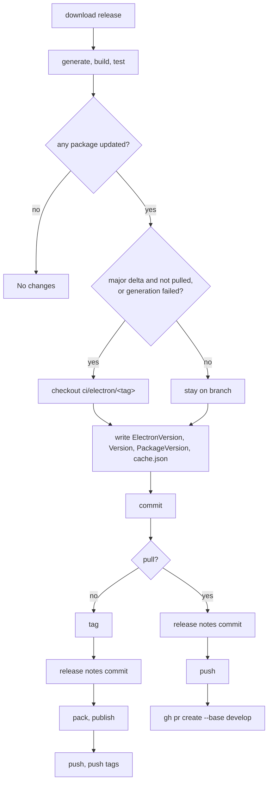

import raw from '!!raw-loader!../../../../ci/Spec.fs';
import GetRegion from '@site/src/components/LineRegions';
import CodeBlock from '@theme/CodeBlock';

# CI Build System

`ci/Build.fsproj` is a [Partas.Build](https://github.com/shayanhabibi/Partas.Build) CLI.
It builds, tests, generates bindings, versions and publishes every package in the repository.

```bash
dotnet run --project ci/Build.fsproj -- --help              # every command
dotnet run --project ci/Build.fsproj -- <command> --help    # the options that command's stages read
dotnet run --project ci/Build.fsproj -- <command> --explain # the resolved stage tree, running nothing
```

## Goals

* Version from conventional commits. The changelog is the single source of truth.
* Publish to NuGet automatically.
* Generate and merge electron binding updates automatically, except:
  * MAJOR electron version changes
  * any generation that fails to build or test
* Exceptions open a pull request into `develop`.

## Commands

| Command | Runs |
|---|---|
| `build` | restore tools, clean, build the `src/` projects (`-p` to choose, `-c` for the configuration) |
| `test` | install the electron test app and run it headless; `--watch` or `--windowed` instead |
| `generate` | download the requested release's `electron-api.json` and regenerate `Fable.Electron/Program.fs` |
| `pack` / `publish` | pack into `bin/`; `publish` also pushes with `--nuget-key` |
| `format` | fantomas over the source and test projects |
| `status` | the versions and bumps a scheduled run would calculate |
| `fable clean\|build\|test` | the fable-specific equivalents |
| `releases` / `releases download` | list the electron releases, or download one |
| `docs` | install and serve the docs site |
| `tool` | pack this project as the `fable-electron` dotnet tool |
| `cron` | the scheduled generation ([below](#the-scheduled-run)) |

| Flag | Effect |
|---|---|
| `--quick` | skip installs, cleans and downloads |
| `--dry-run` | `cron` and `publish` print every git, nuget and github action instead of performing it |
| `--release <semver>` | target a specific electron release instead of `latest` |
| `--only-minor` / `--only-patch` | narrow `latest` to a minor/patch of the release in `ci/cache.json` |
| `-p <Project...>` | restrict `build`, `pack`, `format`, `fable build` to the named projects |

## Layout

```generic
ci
|-- Build.fsproj      # own directory, so the SDK's item globs do not walk the repository
|-- Spec.fs           # the entire tool
|-- cache.json        # the electron release the last run generated against
|-- pull_request.json # reviewers, labels, projects, assignees for generated pulls
```

## Dependencies

* **[Partas.Build](https://github.com/shayanhabibi/Partas.Build)**. The driver. Stages, inputs, producers and the CLI.
* **[Partas.GitNet](https://github.com/shayanhabibi/Partas.GitNet)**. Per-project versioning of a monorepo from
  conventional commits. Each commit is sliced by the project directories it touches. Tags carry a scope prefix so
  packages do not collide: `_(ELECTRON)_38.8.0`, `_(FORGE)_8.3.0`. Uses `LibGit2Sharp`, not the `git` cli.
* **`gh` cli**. Release listing, asset download, pull request creation.
* **WDIO + Mocha**. Tests.

## Spec.fs

### Partas.Build primitives

| Primitive | Meaning |
|---|---|
| `stage "name" { ... }` | A unit of work. Nests. `when'`, `parallel'`, `workingDir`, `run`, `echo`. |
| `input { let! x = Options.x ... return stage ... }` | A stage parameterised by CLI options. `--help` lists only the options a command's stages read. |
| `Producer.define name inputs deps fn` | A named async value, computed once per run. Stages `consumes` it. |
| `DependencySpec.map` / `zip` / `require` | Compose producers into new values without running them. |
| `command "name" { ... }` | A CLI command. Its body lists stages in order. |

### File system

`Repo` is a type provider over the repository. `Repo.FileSystem` has tracked paths, `Repo.VirtualFileSystem` has
the paths in `__VIRTUAL_DIRECTORY__` that may not exist yet, `Repo.Project.<Name>` has project metadata,
`Repo.Git` runs git.

<CodeBlock language="fsharp">{GetRegion(raw, 'FileProvider')}</CodeBlock>

### Projects

<CodeBlock language="fsharp">{GetRegion(raw, 'Projects')}</CodeBlock>

### Options

Declared once. Any stage reads them through `input { let! ... }`.

<CodeBlock language="fsharp">{GetRegion(raw, 'Options')}</CodeBlock>

### Producers

`Inputs.release` resolves the electron release the run targets.

<CodeBlock language="fsharp">{GetRegion(raw, 'ReleaseProducer')}</CodeBlock>

Selection, first match wins:

1. `--release X` → X, or fail.
2. `--cache-release` → the release in `ci/cache.json`.
3. `--only-minor` / `--only-patch` → newest release within that range of the cache.
4. otherwise → the release marked `latest`.

`Inputs.downloadApi` depends on `Inputs.release` and fetches `electron-api.json` into `temp/`.

### Stages

<CodeBlock title="Stage.build" language="fsharp">{GetRegion(raw, 'BuildStage')}</CodeBlock>

<CodeBlock title="Stage.generate" language="fsharp">{GetRegion(raw, 'GenerateStage')}</CodeBlock>

### Commands

<CodeBlock title="build" language="fsharp">{GetRegion(raw, 'CliBuild')}</CodeBlock>

<details>
<summary>Full CLI</summary>
<CodeBlock language="fsharp">{GetRegion(raw, 'Cli')}</CodeBlock>
</details>

## Versioning

### GitNet

Only `src/` projects are versioned.

<CodeBlock language="fsharp">{GetRegion(raw, 'GitNetIgnore')}</CodeBlock>

Commit type → bump:

<CodeBlock language="fsharp">{GetRegion(raw, 'GitNetBumps')}</CodeBlock>

A dry run gives the bumps `Forge` and `Remoting` would receive. Nothing is written.

<CodeBlock language="fsharp">{GetRegion(raw, 'GitNetInit')}</CodeBlock>

### Electron delta

`Fable.Electron` does not version from commits. Its version follows the electron release it was generated from.

<CodeBlock language="fsharp">{GetRegion(raw, 'ElectronDeltaTypes')}</CodeBlock>

| Field | Source |
|---|---|
| `FableElectronPackage` | `<Version>` in `Fable.Electron.fsproj` |
| `FableElectronElectron` | `<ElectronVersion>` in `Fable.Electron.fsproj` |
| `CachedElectron` | `ci/cache.json` |
| `DownloadedElectron` | `Inputs.release` |
| `Dirty` | `git status` reports `Fable.Electron/Program.fs` changed after generation |

`Major`/`Minor`/`Patch` are `Downloaded - FableElectronElectron`.

<CodeBlock language="fsharp">{GetRegion(raw, 'ElectronDeltaRules')}</CodeBlock>

| Delta | Next `Fable.Electron` version | Action |
|---|---|---|
| Major | downloaded electron version | pull request, unless `isProbablyPulled` |
| Minor | downloaded electron version | publish |
| Patch, or `Dirty` | package version, patch bump | publish |
| Equal, not `Dirty` | unchanged | nothing |

`isProbablyPulled`: a major delta where the cache is ahead of the project file's `ElectronVersion`. That state
means the branch was merged from a generated pull, so the run publishes instead of opening another.

## The scheduled run

<CodeBlock title="cron" language="fsharp">{GetRegion(raw, 'CliCron')}</CodeBlock>

`generation` continues on failure and records each failure. Failures force the pull request path and appear in
its body.

<CodeBlock language="fsharp">{GetRegion(raw, 'GenerationFailures')}</CodeBlock>



<details>
<summary>Stage.release</summary>
<CodeBlock language="fsharp">{GetRegion(raw, 'ReleaseStage')}</CodeBlock>
</details>

:::tip
`dotnet run --project ci/Build.fsproj -- cron --dry-run` prints every git, nuget and github action without performing it.
`dotnet run --project ci/Build.fsproj -- status` prints the calculated versions and booleans alone.
:::

Workflows:

| Workflow | Invocation |
|---|---|
| `weekly-scheduled-ci.yml` | `cron --nuget-key ... --gh-key ... --npm-ci` |
| `on-push-to-main.yml` | `cron ... --only-minor --only-patch` |
| `run-test.yml` | `test --npm-ci` on pull requests |
| `run-generator-test.yml` | `generate --cache-release`, then `test`, when the generator changes |
| `test-build-system.yml` | builds the CLI and runs `--explain` on each command when `ci/` changes |
