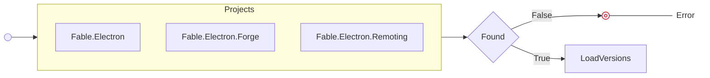
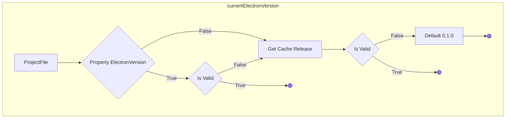
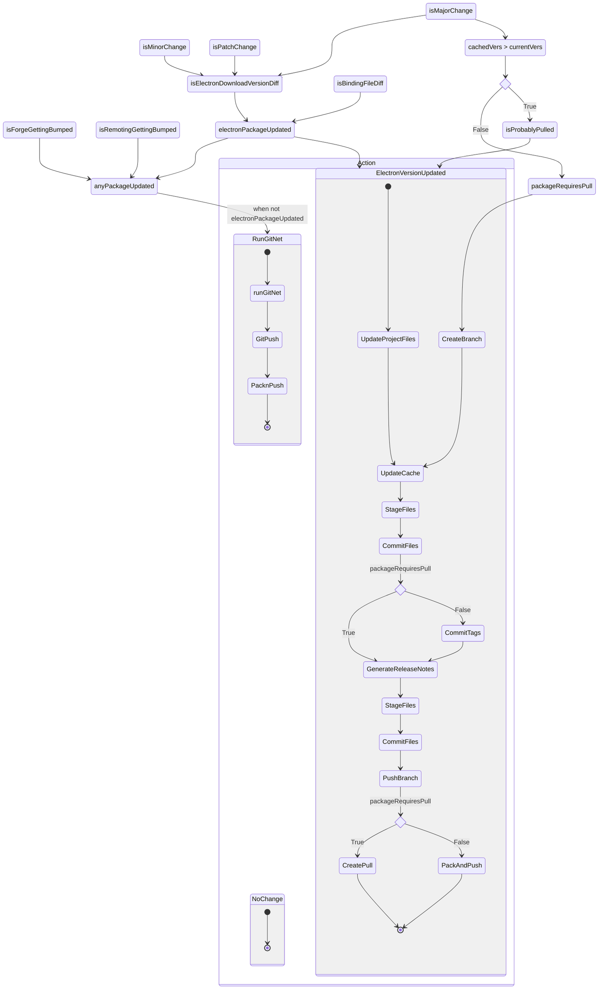

---
title: Build System
---


import raw from '!!raw-loader!../../../../ci/Spec.fs';
import rawBuild from '!!raw-loader!../../../../ci/Build.fs';
import gitnetRaw from '!!raw-loader!../../../../ci/lib/GitNet.fs';
import GetRegion from '@site/src/components/LineRegions';
import CodeBlock from '@theme/CodeBlock';


# CI Build System

Fable.Electron uses a modestly verbose but simple to manipulate build system that allows us to automate generation, packaging, versioning, and whatever else, for multiple projects that fall under the umbrella of the Fable.Electron core supported ecosystem.

## Goals

* Version based on ConventionalCommits, and a changelog as a single source of truth.
* Publish automatically to nuget
* Automatically generate and update electron bindings to the main repository, with exceptions:
  * DO NOT automatically merge MAJOR version changes in electron bindings
  * DO NOT automatically merge any version change that fails tests (due to generator failure or other)
* If an exception for automatic generation occurs, create a PULL REQUEST to the DEVELOP branch

More goals may come to bear as we move along. Using this guide, hopefully you will understand how to manipulate the build system effectively.

:::note
Additionally, it also acts as a central abstraction for various operations.

As an example, you can run the docs in dev mode from the root of the repo by running

```bash
dotnet run -- docs [--npm-ci]
```

Use `dotnet run -- --help` to see what is available.
:::

## Architecture

### FAKE

The core _driver_ of the build system is the [F# FAKE Framework](https://fake.build/).

> Please see the documentation for [FAKE](https://fake.build) regarding the particulars of its usage.

### GH

We utilise the `gh` cli for navigating github and downloading release files programmatically.

### GitNet

GitNet is a library for versioning F# Monorepos using conventional commits, and a flavor of semver that allows us to distinguish git tags for our monorepo packages.

:::tip Example
Imagine our repository, which contains 3
independently versioned packages: Fable.Electron, Fable.Electron.Forge, Fable.Electron.Remoting.

Normally we would create a tag for each version/release such
as 'v38.8.0'.

Now imagine the following git tag history:
* v38.8.0
* v0.1.0
* v38.8.1
* v1.0.0

How can we tell which version relates to what package change?

In this flavor, a prefix is appended that distinguishes the version: `_(ELECTRON)_38.8.0`; `_(FORGE)_8.3.0`
:::

GitNet essentially 'slices' the commit history for each project, based on which commits effect that project directory.

This allows granular automated versioning, without worrying about using footer tags to delineate between projects.

### WDIO & Mocha

We use WDIO along with Mocha for testing.

## Structure

```generic
ci
|-- Spec.fs
|-- lib
|   |-- GhClient.fs
|   |-- Electron.fs
|   |-- GitNet.fs
|   |-- Workers.fs
|   |-- TargetOperators.fs
|-- Build.fs
```

### Spec.fs

This is a _specification_ file, with other generic helpers initialisers mixed in.

The significant aspects are described below.

#### File Navigation

We have compile time file system safety using EasyBuild.FileSystemProvider.

You can navigate the file system by accessing the static properties of the `Root` or `VirtualRoot` types.

<CodeBlock language={'fsharp'}>{GetRegion(raw, 'FileProvider')}</CodeBlock>

Most of the essential folders/files you might want to navigate to are predefined:

<CodeBlock language={'fsharp'}>{GetRegion(raw, 'PredefinedFileProvider')}</CodeBlock>

#### Targets

[`FAKE` Targets](https://fake.build/guide/core-targets.html) are defined as literals
in the `Ops` module.

They are accessible via the build system directly using `dotnet run -- run --target [TARGET]`.

<CodeBlock title={'Example snippet of Ops module'} language={'fsharp'}>{GetRegion(raw, 'TargetsExample')}</CodeBlock>

:::note
The Targets do not necessarily map 1-to-1 to our _cli_ API though.

For instance, a command to run the `test` system might have a cleanup operation we want to run
conditionally after the the `test` is completed. So the actual run target might need to be `post-test`.
:::

#### Args

We define any flag literals in the `Ops.Args` module.

<CodeBlock title={'Example snippet of Args module'} language={'fsharp'}>{GetRegion(raw, 'ExampleArgsDef')}</CodeBlock>

These are set, and accessible from the `Args` type.

<CodeBlock title={'Example snippet of Args Type'} language={'fsharp'}>{GetRegion(raw, 'ArgsType')}</CodeBlock>

#### Commands

The commands map directly to our _cli API_. These literals are defined in the `Commands` module.

<CodeBlock title={'Example snippet of Commands module'} language={'fsharp'}>{GetRegion(raw, 'ExampleCommandsDef')}</CodeBlock>

#### CLI

The CLI is then parsed from, and defined by, the `Cli` type:

<CodeBlock title="Cli Type" language="fsharp">{GetRegion(raw, 'CliType')}</CodeBlock>

:::note
While we inject the literals from the `Commands` module, doing the same for the flags would
make formatting the details section annoying without string concatenation.
:::

### lib/GhClient.fs

This defines a `Fake` like module and types for using the `gh` cli tool similar to other tools in `Fake`.

### lib/Electron.fs

Further abstractions over `GhClient.fs` for interacting directly with the `electron/electron` repository.

### lib/GitNet.fs

Defines the configuration of, and initial runtime for, GitNet.

#### Ignored projects

Ensure that any `.fsproj` projects are ignored here, to prevent them having release notes
generated for.

<CodeBlock language={'fsharp'}>{GetRegion(gitnetRaw, 'IgnoreProjects')}</CodeBlock>

#### Other

Hopefully the rest of the configuration for GitNet is self-explanatory in the code.

You can explore the records with intellisense to see what configuration options are available.

### lib/Workers.fs

Consider these as bindings to most of the operations that we might string together in a Target op to complete
a part of our pipeline.

It is beneficial to partition ops into smaller parts - a good contribution would be doing this for the
`Ops.gitnet` op.

### lib/TargetOperators.fs

Additional operators to supplement `Fake.Core.TargetOperators`.

### Build.fs

This is the meat of the Build system.

This is where we declare our Target operations. For the most part, they are fairly self explanatory,
as they utilise the helpers defined in `lib/Workers.fs`.

#### Status

<CodeBlock language="fsharp">{GetRegion(rawBuild, 'StatusModule')}</CodeBlock>

The status module tracks two global values that are filled by different Target ops.

The `Cache` value is stored in `ci/cache.json`, and is a tracked copy of the release info JSON that was previously
generated/operated on.

:::note
Workers can write to the cache, and the Target op `load-cache` will fill it.
:::

On the other hand, the `Release` value is the __current__ release that was downloaded. The `Release` value would be
`None` if we were to not utilise one of the `download` target operations.

:::info
The three download targets are `download-api`, `download-input` and `download-latest`.

<CodeBlock title={'Spec.Ops module'} language="fsharp">{GetRegion(raw, 'DownloadTargets')}</CodeBlock>

* `download-api` will download a release that is passed through the `--release` flag.
* `download-latest` searches the releases for the one that is marked `latest`.
* `download-input` will list the versions available, and you can choose a version to download.
:::

#### Tracking Electron Release Versions

As mentioned, we do track the current downloaded release version, and previous release version through the `Status.release`
and `Status.cache` values respectively.

We also locally track the current bound electron version in the project file for `Fable.Electron` directly.

:::important
We do not update the project files until we are packing and pushing to NuGet.

This allows us to distinguish between CI pipelines that create pulls for major versions, their
eventual merges, and our normal build operations.

* When creating a pull for a major version change, or because an error occurs in generation for a minor change (or other), we will update the `cache.json` with the release info.
* This creates a context where the `cache.json` release info is higher than the project file electron version
* When we merge the pull, this indicates that this was a CI generated pull/merge and we can publish the version change.
:::

:::note
This approach uses a common operation for all merge/pull/push triggers, which is `gitnet`.

You could instead use `.yaml` workflows to target merge, pull, or push specifically (although the nuances with GitHub workflows have to be accounted for), and reduce the reliance on file values. You would have to make sure the yaml workflows trigger their appropriate targets.
:::

#### Target `gitnet`

This target is essentially what was cooked up to serve as a single operation that would automatically control and version the different packages.

As this might likely call for changes, we will thoroughly disambiguate its operations.

:::note
While writing this, I found it easier to iterate by having the full operations splayed out, rather than partitioned into worker functions.

Not very idiomatic, and desperately could use better structure.
:::

---

<CodeBlock title={'1. Load the projects'} language={'fsharp'}>{GetRegion(rawBuild, 'gitnet1')}</CodeBlock>

We first check that `GitNet` cracker finds the three projects we are interested in packaging.



---

<CodeBlock title={'2. Load the current versions'} language={'fsharp'}>{GetRegion(rawBuild, 'gitnet2')}</CodeBlock>

* **currentElectronVersion**



* **`CrackedProject.withFsProj`**

```fsharp
val withFsProj: fn: (XDocument -> Result<unit,'E>) -> proj: CrackedProject -> Result<unit,'E>
```

This provides us access to read or write to the project file.

If `fn` returns `Ok`, then the file is saved on completion of the function.

We can read values and return them in `Error` to access outside the function.

However, the other helper functions such as `CrackedProject.Document.withProperty` expect `unit` return functions, as they are primarily for writing over properties.

* **`downloadedVersion`**

The use of `Option.get` implies that the CI expects, and requires, there to have been a `download` target preceding it.

Releasing this requirement would require proper handling.

* **`getInitVersionElectron`**

This is a helper binding defined in `lib/GitNet.fs`. A dry run on initialisation provides
us information including what bumps to expect, and the package initial versions.

Since GitNet does not assume these properties are set in the project files, they are options.

---

<CodeBlock title={'3. Calculate version deltas'} language={'fsharp'}>{GetRegion(rawBuild, 'gitnet3')}</CodeBlock>

* **`isLocalBindingDirty`**

We use a `lib/Workers.fs` helper to determine if the `Fable.Electron/Program.fs` (our bindings) file has changed during generation.

In the scenario where we modify our generator, we would expect the output to change, but the electron version deltas would be 0.

This boolean would indicate that we would still need to bump and publish the package.

---

<CodeBlock title={'4. Next version, and compound booleans'} language={'fsharp'}>{GetRegion(rawBuild, 'gitnet4')}</CodeBlock>

---

Because a normal GitNet run would bump versions depending on their commits, we need to manually re-create the workflow so that we can programmatically control the version of electron that we would bump to.


<details>
 <summary>{'5. Branching workflow based on compound booleans'}</summary>   
<CodeBlock language={'fsharp'}>{GetRegion(rawBuild, 'gitnet5')}</CodeBlock>
</details>

:::tip
Running the `gitnet` target with the flag `--dry-run` can be helpful to see what operations would run without actually committing to any changes.

You can also see here, repeated usage of, git operations such as file staging, committing, and tagging via methods on the `GitNet` runtime.

GitNet uses `LibGit2Sharp` rather than the `git` cli.
:::

#### Target Dependencies

<details>
    <summary>{'Defining Target Dependencies'}</summary>
<CodeBlock language={'fsharp'}>{GetRegion(rawBuild, 'TargetDeps')}</CodeBlock>
</details>

> See the guide [`FAKE` Targets](https://fake.build/guide/core-targets.html).

|           Operator           | Description                                                     |
|:----------------------------:|:----------------------------------------------------------------|
|          `x ==> y`           | `y` requires `x`                                                |
|          `x ?=> y`           | if `x` is run, then it must occur before `y` (soft dependency)  |
|    `x =?> (y, predicate)`    | `y` requires `x` if the `predicate` is true.                    |
|        `x <== y list`        | `x` requires each `y`                                           |
|       `x ===> y list`        | Each `y` requires `x`                                           |
|       `x <==? y list`        | If any of `y` occur, they must occur before `x`                 |
|       `x ?==> y list`        | Each `y` would require `x` to occur first, if `x` was being run |
| `x ?=?> (y, predicate) list` | For each `y`, they require `x` if `predicate` is true           |
| `x <?=? (y, predicate) list` | For each `y`, `x` is dependent on `y` if `predicate` is true    |
