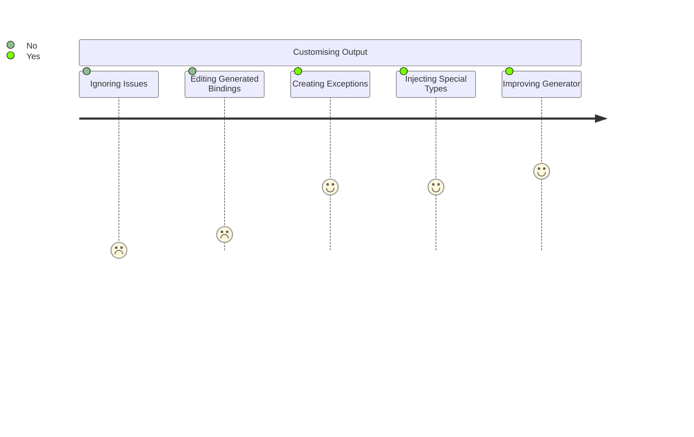

---
title: Creating Exceptions in Generation
---

import raw from '!!raw-loader!../../../../src/ElectronApi.Json.Parser/Spec.fs';
import rawMap from '!!raw-loader!../../../../src/ElectronApi.Json.Parser/SourceMapper.fs';
import rawGen from '!!raw-loader!../../../../src/ElectronApi.Json.Parser/Generator.fs';
import GetRegion from '@site/src/components/LineRegions';
import CodeBlock from '@theme/CodeBlock';

# Creating Exceptions in Generation

If you wish to modify the usage or bindings in some manner, there's some considerations to keep in mind.

### Why are you modifying the bindings?

The bindings are _supposed_ to be generated directly from the source. They should be just that, bindings.

#### Different Style/Design

If you want to use the bindings in a different style then raise an issue! If it's something that is appealing,
it could perhaps be integrated into the generation (such as the methods for events). 

Otherwise, we might consider creating libraries that are built ontop of the bindings.

#### Issues

If there are issues, we have to consider whether:

* The issue is due to generated bindings
* The issue is due to lacking dependencies (ie Node)
* The source material is incorrect

##### Bad Generation

This is certainly something that should be addressed!

Please raise an issue or pull request if one does not exist, so multiple people perhaps do not work on the same 
fix.

##### Lacking Dependencies

There is naturally a lot of dependency on the Node api in `electron`, and any lacking dependency should be addressed in
`Fable.Node` so that we can introduce the dependency to our bindings.

##### Source is Incorrect

We will want to address the issue to the electron source repository as well, and then track it from our repository.

### Other

Raise an issue, we'd love to hear from you!

## Example: [Touchbar](https://www.electronjs.org/docs/latest/api/touch-bar)

The `Toolbar` and associated APIs often accept any of the ~9-10 `Toolbar` associated classes as a parameter
or argument.

Not only does this fall outside the range of the built-in `U#` Fable erased unions, it would also create
a poorly readable type signature.

This would be better suited to a custom erased discriminated union named `TouchbarItems` with cases such as
`Button` that are of type `TouchbarButton`.

There are some issues here:

* We cannot introduce this type in the helper `Fable.Electron/Types.fs` as it requires the `Touchbar` types to be defined.
* We do not want to hand-roll and manage all the `Touchbar` types.
* We cannot introduce the type after-the-fact, because the union type is referenced as a type for parameters/arguments.
* We cannot define the type in `Fable.Electron/Types.fs` and then extend it after the fact, as we cannot extend with cases.

### Prebaked Types

This is an example where a 'prebaked' type definition can be useful.

We will prebuild the Fantomas.SyntaxOak definition for the type, and then inject the type somewhere while constructing the
source.

We will also have to pattern match against the references to the union of these types and have
them reference this custom type instead of creating/generating (and failing) to produce a union using the `U#` constructs.

{'ElectronApi.Json.Parser/Spec.fs'}

<CodeBlock language={'fsharp'}>{GetRegion(raw, 'TouchBarItemsImpl')}</CodeBlock>

:::note
The `touchbarItemsName` literal is defined higher in the module so that it can be referenced as a binding from
other parts of the codebase.
:::

With our type defined, we have to:

1. Intercept references to the union and remap it to our type
2. Inject the definition

### Interception

The `Type.FantomasFactory.mapToFantomas` in `ElectronApi.Json.Parser/SourceMapper.fs` takes one of our primitive
type constructs and converts it into a Fantomas type (that will eventually be rendered as the type signature).

This is an ideal place to intercept type signature rendering.

<CodeBlock title={'ElectronApi.Json.Parser/SourceMapper.fs | Type.FantomasFactory.mapToFantomas method'} language={'fsharp'}>{GetRegion(rawMap, 'TouchBarItemsMap')}</CodeBlock>

:::note
We are also accounting for the union of `TouchbarItems` with other types with the
second pattern match.

Thankfully, the docs have the touchbar item names alphabetically sorted helps performance.
:::

Ordinarily, the method `mapToFantomas` would return a Fantomas `Type` DU. As you can see in the above snippet,
we are remapping the preliminary information and then refeeding (recursive application) it to the method to resolve.

> If a `StructureRef` doesn't match any other exceptions, then it will be rendered as a literal. ie
> `Prelude.Type.StructureRef "String"` will render as `String`.

### Injection

When generating source code, we generally map type definitions to a `GeneratorGroupChild` which is rendered
by a `GeneratorGrouper` (a module essentially). One of these unions is `EventInterface` which is a case of
a tuple `PathKey * TypeDefn`.

This is an ideal construct to hijack with prebaked type to be rendered as is.

We know by the source that these types/classes are referenced from the `Main` process, so we inject
the type with a pathkey that derives from a `Main` module.

    
ElectronApi.Json.Parser/Generator.fs | Transpiler.processModifiedResultList function

<CodeBlock language={'fsharp'}>{GetRegion(rawGen, 'Injection')}</CodeBlock>

The outcome of this is that we will find our type generated in the source code accessible by `Fable.Electron.Main.[TYPENAME]`.

## Other Examples

If you look at some of the pattern matches for `Type.FantomasFactory.mapToFantomas`, you'll notice other exceptions.

 
{'ElectronApi.Json.Parser/SourceMapper.fs | Type.FantomasFactory.mapToFantomas method'}
   
<CodeBlock language={'fsharp'}>{GetRegion(rawMap, 'mapToFantomas')}</CodeBlock>

There are various reasons for these exceptions, but the most common is matching the type names in electron/node to
the defined type names/interfaces in Fable.

Another reason is is to slice off known prefixes such as 'NodeJS' and 'Electron'.

The most simple outcome is to map them with a string that is rendered as a literal (which is the outcome of using the `makeSimple` function).
