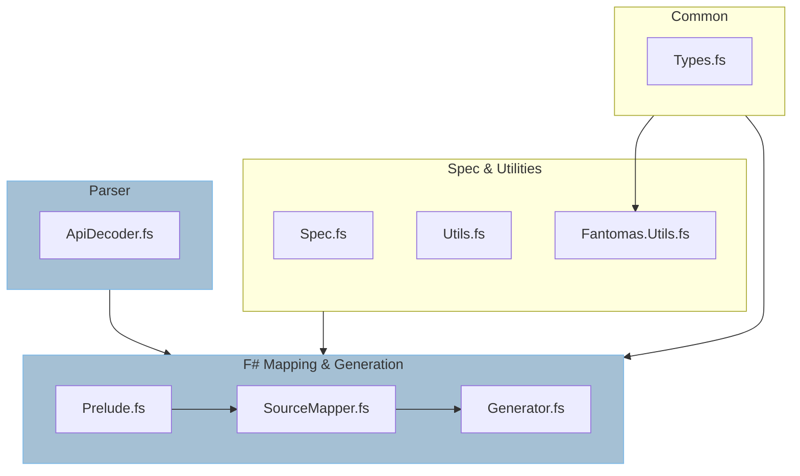
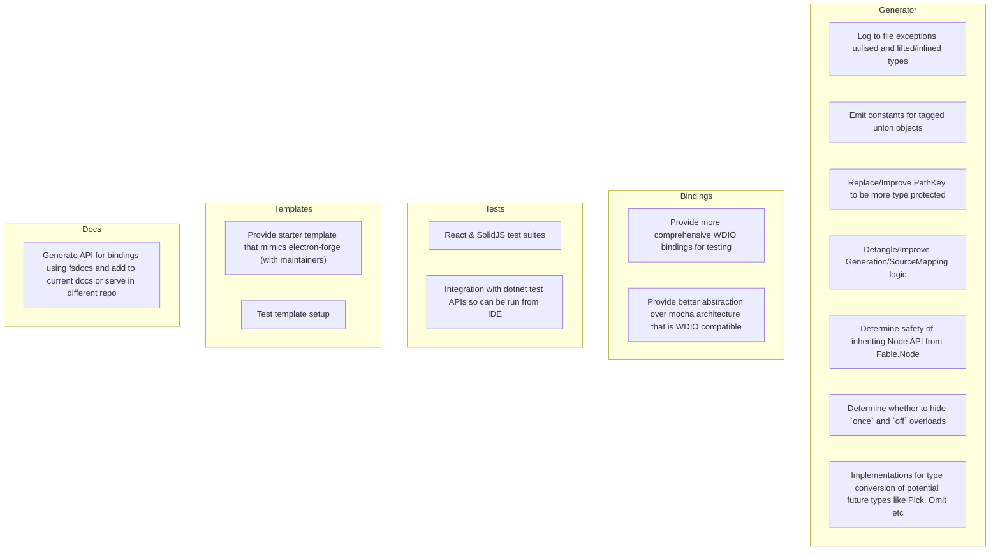

---
title: Introduction
sidebar_position: 0
---

# Development Introduction

This series of documentation relates to the contribution and development of the
`Fable.Electron` generator and libraries.

## Technologies

The project utilises `Fantomas` and `Thoth.Net.Json`.

`Fantomas` is used for source generation, while `Thoth.Net.Json` is utilised in
the parsing of the `electron-api.json` document from which our source is generated.

## General Structure

## Consideration for Future Direction

A non-exhaustive list of considerations of future direction for generation,
remoting, and/or bindings in general.

## Contributing

All contributions are welcome! We appreciate any form of contribution, whether it's a pull request, an issue, a blog post, documentation, or just a star!

### Maintainers

:::important
Ensure all commits and merges into the main branch use conventional commits.

Other commits will be excluded from the release notes, and from consideration for versioning.

You can choose to squash pulls into a conventional commit if this is easier.

**Try** to keep commits for different projects separate to each other. This will allow your commit messages, and the subsequent release notes to be more informative.

If you can't decide between the type of a commit, always default to the higher one (ie, if you have a squashed commit for a fix and feature, make the type a feature).
:::

### Pull Requests

If you wish to make a pull request, please target the `develop` branch for your pull.

### Issues

If you have a bug, or feature to request, or just need some help, please submit an issue.

If you're unsure of how to proceed with a pull, we can discuss it before moving to a draft pull and iterating over your contribution.

### Fantomas

The codebase is formatted using Fantomas. You can run `dotnet run -- format` from the root of the directory to use fantomas with the `Fable.Electron/Program.fs` bindings file already ignored.

### Versioning

If you use conventional commits diligently, you can forget about versioning. This is abstracted away for you.

The only thing to keep in mind is that you must indicate a breaking change by following the type of the commit with an exclamation mark:

:::important Not breaking
`feat: Add new methods`
:::

:::danger Breaking
`feat!: Add new methods`
:::

### GH CLI

The build project utilises the `gh` cli, please ensure you have this installed before using the `download` commands.
